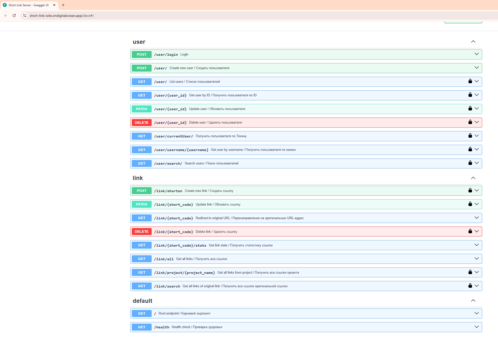
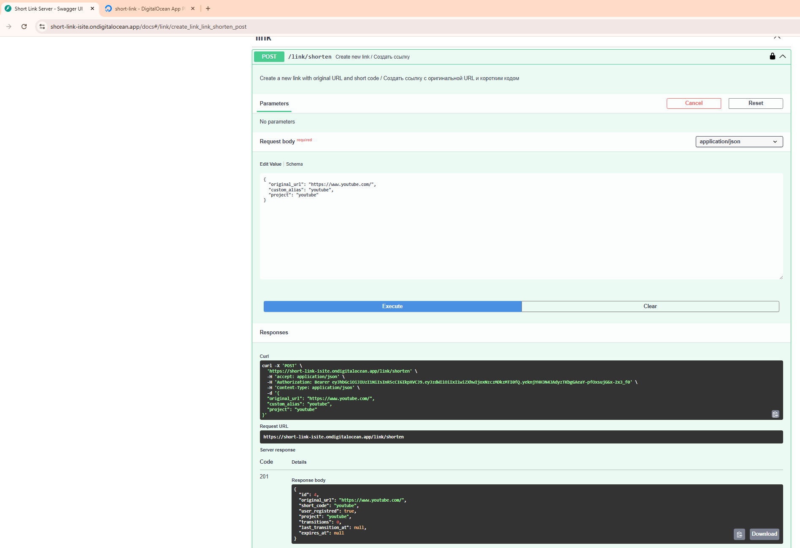
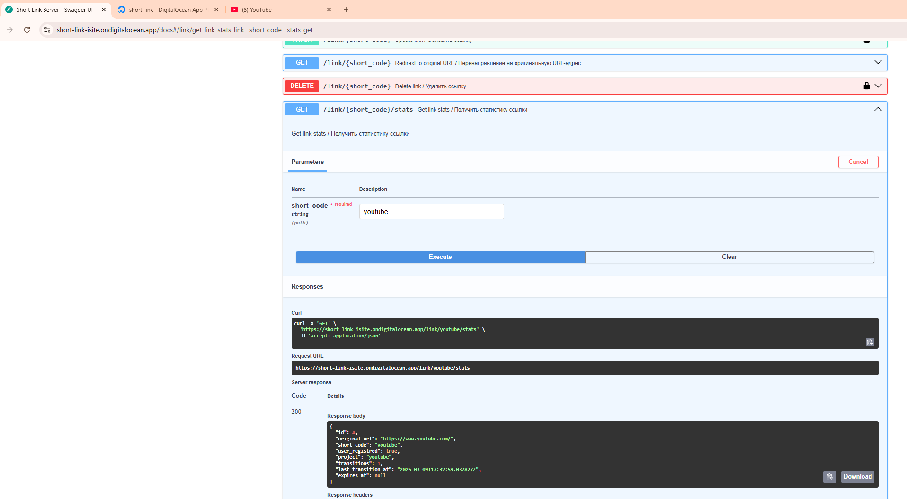

# ДЗ  3 API-сервис сокращения ссылок.

## Константинов Никита Дмитриевич

### Установка

1. Клонируйте репозиторий:

```bash
git clone https://github.com/Endcru/Short_Link.git
```

2. Перейдите в папку проекта

3. Запустите приложение с помощью Docker Compose:

```bash
docker compose up --build
```

4. После сборки сваггер будет доступен по адресу:

http://localhost:8008/docs

### Описание API

API доступен по ссылке: [Сокращатель ссылок](https://short-link-isite.ondigitalocean.app/docs#/)



### Пример работы API

#### Создание сокрашённой ссылки



#### Получение статистики сокращённой ссылки



Ссылка для проверки работы приложения: https://short-link-isite.ondigitalocean.app/link/youtube

### Описание БД

БД создано с помощью контроля версий alembic на технологии sqlalchemy

Две основные таблицы:

| Поле         | Тип      | Описание                              |
| ------------ | -------- | ------------------------------------- |
| `id`         | int      | Уникальный идентификатор пользователя |
| `username`   | str      | Имя пользователя                      |
| `email`      | str      | Электронная почта (уникальна)         |
| `password`   | str      | Хэш пароля                            |
| `is_admin`   | bool     | Флаг администратора                   |
| `is_active`  | bool     | Активность пользователя               |
| `links`      | list     | Связь с таблицей `links`              |
| `created_at` | datetime | Дата создания                         |
| `updated_at` | datetime | Дата последнего обновления            |


| Поле                 | Тип      | Описание                                  |
| -------------------- | -------- | ----------------------------------------- |
| `id`                 | int      | Уникальный идентификатор ссылки           |
| `original_url`       | str      | Исходная URL                              |
| `short_code`         | str      | Короткий код ссылки (уникальный)          |
| `transitions`        | int      | Количество переходов по ссылке            |
| `last_transition_at` | datetime | Дата последнего перехода                  |
| `expires_at`         | datetime | Дата истечения срока действия ссылки      |
| `project`            | str      | Название проекта, если есть               |
| `user_id`            | int      | Внешний ключ на `users.id`                |
| `created_at`         | datetime | Дата создания                             |
| `updated_at`         | datetime | Дата последнего обновления                |


### Тестирование

Для тестирования используется pytest. Для гарантии работы тестирования необходимо установить бибилиотеки из requirements.txt

Для тестирования приложения перейдите в папку приложения и выполните следующие команды:

```bash
coverage run -m pytest
coverage report
coverage html
```

Отчёт о покрытии кода: [htmlcov/index.html](https://htmlpreview.github.io/?https://raw.githubusercontent.com/Endcru/Short_Link/main/htmlcov/index.html)

### Нагрузочное тестирование (Locust)

Для нагрузочного тестирования приложения перейдите в папку приложения и выполните следующую команду:

```bash
locust
```

#### Отчёты нагрузочного тестирования:

Для просмотров файлов их необходимо скачать для локального просмотра из-за наличия графиков

- **Без Redis**: [отчёт](https://github.com/Endcru/Short_Link/blob/main/locustreports/Locust_2026-03-15-03h02_locustfile.py_http___localhost_8008.html)
- **С Redis**: [отчёт](https://github.com/Endcru/Short_Link/blob/main/locustreports/Locust_2026-03-15-03h15_locustfile.py_http___localhost_8008.html)

#### Вывод по нагрузочному тестированию:

Как можно заметить по статистике с использованием Redis запрос 	/link/[short_code] работает в два раза быстрее чем без его использования (3ms с Redis и 6ms без него)